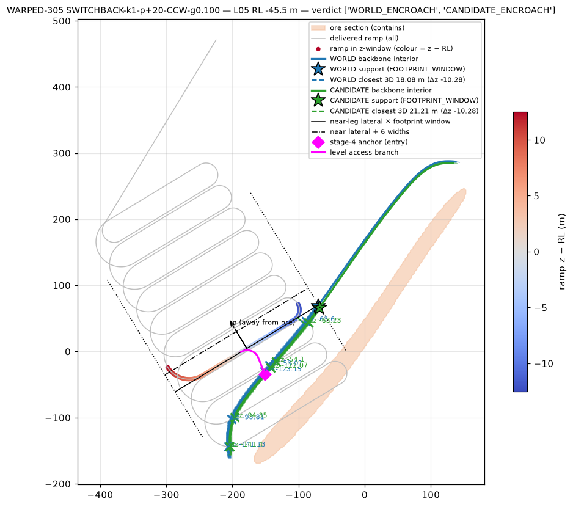
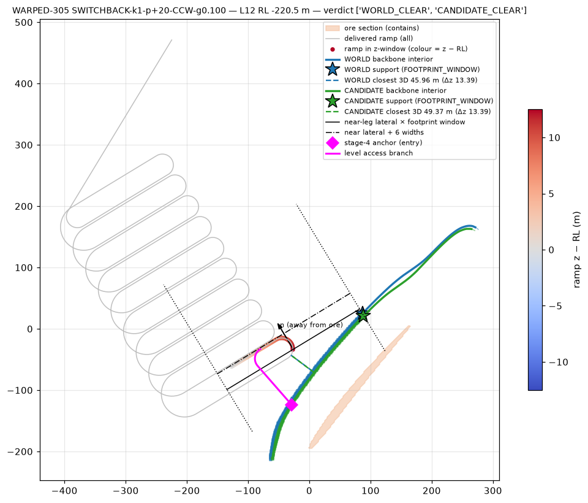
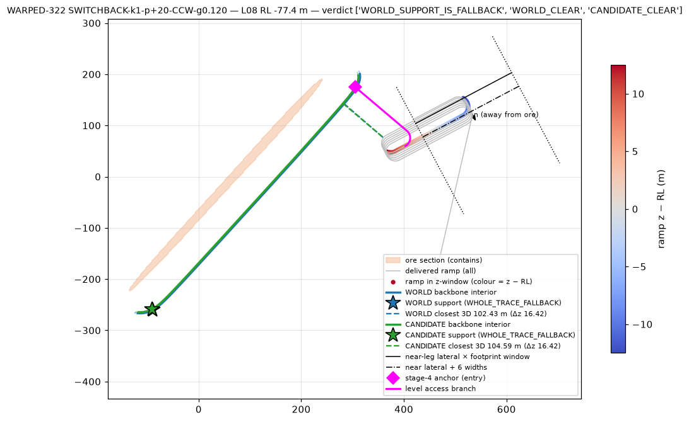

# Phase 20C.4 — Gate C step 0: open finding F1 resolved

Diagnostic artifact: `backend/golden/phase20c4_c0_f1.json` (audit on 2df98f2, production change 0). Script: `scripts/phase20c4_c0_f1.py`. Figures: `docs/verification/img/phase20c4_c0_*.png`. This step decides whether SWITCHBACK enters the Gate C implementation; it changes no production code, threshold, coefficient or golden.

## 1. Question

Gate B (§2, F1): on the successful SWITCHBACK winners of WARPED-305 and WARPED-322 the WORLD construction backbone inside the candidate's own footprint reads at or beyond the delivered near leg on five levels (305 L05 / L07 / L12, 322 L08 / L09) although the level access succeeded. Reading (a): a footprint / window artefact. Reading (b): a genuine ramp ↔ development-backbone crossing that no current gate validates.

## 2. Method (actual geometry, production code)

- Winners rebuilt with the production `LayoutV2Search` (RANDOM_WARPED_VEIN 305 and 322; 301 as the SPIRAL reference). Two backbones per level: the WORLD-policy offset trace (token `WORLD`, world anchor stand-off 22.36 m) and the CANDIDATE-policy offset trace rebuilt through `candidate_policy` (REFINED_CONSERVATIVE, stand-off 20.0 m) — the backbone the level builder actually develops on (rule 180).
- Per level: the Gate B footprint support (`|along − nearLegCentre| ≤ leg/2 + 6·width`) and WHERE it came from (window vs whole-trace fallback); a **tightened** footprint support — the ramp's OWN along-extent about the construction leg centre (`leg/2 + R_min`: all switchback legs are stacked on one along-centre and every hairpin adds `R_min`; spiral: the rim `R`), trace interior only, empty window ⇒ δ = 0, the 6-width margin applied laterally only; the minimum plan distance between the ramp inside ± half a level interval and the backbone; the minimum 3-D distance between the whole ramp and the backbone at the level elevation; every plan intersection with its ramp z gap; the backbone obliquity (mean backbone tangent inside the window vs the leg direction).
- Diagnostic bands from existing planning constants, never gates: CONFLICT below 3 × width = 15 m (two half-widths + the rule-171 2-width pillar), ENCROACH below 6 × width = 30 m (the rule-170 corridor intent), CLEAR otherwise.

## 3. Results

WORLD backbone unless stated; δ in metres. "plan d" = minimum plan distance ramp(z-window) ↔ backbone; "3D d" = minimum 3-D distance whole ramp ↔ backbone; "req." = outward move restoring 30 m at the closest plan approach (lower bound).

### WARPED-305 SWITCHBACK-k1-p+20-CCW-g0.100 (leg 193.5 m, R_min 18 m, obliquity 24–34°)

| level | near lateral | Gate B pts / δ | tightened pts / δ | obliquity | plan d | 3D d (WORLD / CAND) | req. | band |
|---|---|---|---|---|---|---|---|---|
| L02 | 175.9 | 24 / 0.0 | 79 / 0.0 | 23.8° | 90.9 | 53.4 / 54.7 | 0 | CLEAR |
| L03 | 136.0 | 110 / 0.0 | 102 / 0.0 | 24.8° | 42.8 | 44.0 / 45.8 | 0 | CLEAR |
| L04 | 136.2 | 85 / 0.0 | 139 / 0.0 | 32.9° | 53.1 | 34.7 / 35.9 | 0 | CLEAR |
| **L05** | 96.3 | 138 / **29.5** | 130 / **25.7** | 27.8° | **14.9** | **18.1 / 21.2** (Δz −10.3) | 15.1 | **ENCROACH** |
| L06 | 96.4 | 80 / 0.0 | 134 / 5.5 | 27.4° | 45.9 | 32.1 / 33.3 | 0 | CLEAR |
| **L07** | 56.6 | 148 / **23.7** | 140 / **20.0** | 31.4° | **19.6** | **22.1 / 26.3** (Δz −10.1) | 10.4 | **ENCROACH** |
| L08 | 56.7 | 75 / 0.0 | 128 / 0.0 | 33.7° | 61.6 | 36.4 / 39.7 | 0 | CLEAR |
| L09 | 16.8 | 98 / 0.0 | 90 / 0.0 | 28.3° | 48.2 | 49.3 / 55.3 | 0 | CLEAR |
| L10 | 16.9 | 29 / 0.0 | 85 / 0.0 | 30.0° | 81.5 | 45.6 / 49.5 | 0 | CLEAR |
| L11 | −22.9 | 96 / 6.7 | 85 / 1.2 | 32.3° | 33.6 | 35.5 / 40.0 | 0 | CLEAR |
| **L12** | −15.0 | 144 / **21.3** | 78 / **0.0** | 32.6° | 47.1 | 46.0 / 49.4 | 0 | CLEAR |

### WARPED-322 SWITCHBACK-k1-p+20-CCW-g0.120 (leg 151.8 m, R_min 18 m, obliquity 28–44°)

| level | near lateral | Gate B pts / δ | tightened pts / δ | plan d | 3D d (WORLD / CAND) | band |
|---|---|---|---|---|---|---|
| L03 | 107.1 | 63 / 0.0 | 53 / 0.0 | 53.5 | 54.2 / 56.3 | CLEAR |
| L04 | 112.2 | 26 / 0.0 | 65 / 0.0 | 80.7 | 59.0 / 61.1 | CLEAR |
| L05 | 103.3 | 74 / 0.0 | 64 / 0.0 | 64.1 | 64.7 / 66.8 | CLEAR |
| L06 | 108.4 | 17 / 0.0 | 56 / 0.0 | 100.8 | 78.5 / 80.5 | CLEAR |
| L07 | 99.5 | 51 / 0.0 | 41 / 0.0 | 86.6 | 87.0 / 89.1 | CLEAR |
| **L08** | 106.0 | **0 (whole-trace fallback) / 112.2** | 20 / **0.0** | 124.9 | 102.4 / 104.6 | CLEAR |
| **L09** | 96.9 | **0 (whole-trace fallback) / 109.8** | 0 / **0.0** | 152.1 | 124.3 / 126.6 | CLEAR |

### WARPED-301 SPIRAL-n1-CW-e+0-g0.120 (rim R 33.2 m, obliquity ≤ 5°) — reference

Gate B δ 9.7 → 0.4 m (L03 → L16); tightened (rim only) δ 7.6 → 0.0; plan = 3-D distance 24.7 → 34.7 m; L03–L10 ENCROACH (21.9–28.8 m), L11–L16 CLEAR; required move 5.3 → 0 m. The spiral reading is clean under both footprints, as Gate B stated.

Plan crossings: every plan intersection between the ramp and a level backbone has |Δz| ≥ 33.8 m (deeper legs crossing a shallower level's backbone line in plan, one to five levels below it) — no crossing near any level plane. The CANDIDATE-policy backbone support is ≤ the WORLD support on every measured level of all three winners (e.g. 305 L05 91.86 vs 95.76 m), consistent with the stage-4 dominance invariant that C1 asserts as a test.

## 4. Resolution per flagged level

| level | verdict | evidence |
|---|---|---|
| 322 L08 | **WINDOW_ARTEFACT** | no backbone point inside the footprint; the Gate B shadow fell back to the whole trace (support 188 m, 522 m from the ramp); ramp 102 m (3-D) from the level backbone; tightened δ = 0 |
| 322 L09 | **WINDOW_ARTEFACT** | same; ramp 124 m; tightened δ = 0 |
| 305 L12 | **WINDOW_ARTEFACT** | the near set is the terminal hairpin (no straight leg inside the z-window); a window centred on it plus the 30 m along margin reads an oblique backbone 125.6 m from any ramp sample; ramp 46 m (3-D), CLEAR; tightened δ = 0 |
| 305 L05 | **GENUINE_ENCROACHMENT** (not a crossing) | the leg-end hairpin passes 14.9 m (plan) / 18.1 m (3-D, 10.3 m below the RL) from the WORLD backbone and 21.2 m from the CANDIDATE backbone the drift is developed on; inside the 6-width intent, outside the 3-width conflict band; tightened δ 25.7 m against a 15.1 m perpendicular shortfall (surplus from the 27.8° obliquity) |
| 305 L07 | **GENUINE_ENCROACHMENT** (not a crossing) | 19.6 m / 22.1 m (Δz −10.1) from the WORLD backbone, 26.3 m from the CANDIDATE backbone; tightened δ 20.0 m against 10.4 m |

## 5. Decision

- **Reading (b) does not hold**: no ramp ↔ backbone crossing near a level plane, no excavation conflict (minimum 3-D centerline distance 18.1 m ≥ 15 m) on any level of either winner. There is no new typed level-builder finding to raise.
- **Reading (a) holds for 322 L08 / L09 and 305 L12**, for two distinct reasons: an empty footprint answered with a whole-trace fallback, and a window centred on delivered samples (a hairpin) extended by the along margin over an oblique backbone.
- **305 L05 / L07 are the mechanism the contract corrects**: the leg is closer to the level backbone than the rule-170 intent, the access succeeded only because no gate measures ramp ↔ drift proximity, and a positive δ there is correct (conservative on oblique backbones — the lateral projection over the along-window can only over-shoot the perpendicular need, never under-shoot it, so the corridor is never left too close).
- **SWITCHBACK: SAFE TO PROCEED (C3)** under two refinements of the Gate B contract, applied to both families: (i) the footprint is the ramp's OWN along-extent about the construction centre — SWITCHBACK `leg/2 + R_min` about the shared leg centre (the track centroid at the join elevation), SPIRAL `R` about the axis — and the 6-width margin is lateral only, never along; (ii) an empty footprint yields δ = 0, never a fallback. The contract quantities are otherwise unchanged (WORLD construction reference, trace interior, δ ≥ 0, piecewise-linear in z, explicit stand-off preserved, LONGITUDINAL deferred).
- **Recorded observations, out of scope here**: (1) ramp ↔ level-drift proximity is measured by no current gate (the access planner judges the branch pillar only); the current 305 (L05 / L07) and 301 (L03–L10) winners sit in the ENCROACH band; the reference moves those corridors outward, and a separation DIAGNOSTIC (never a gate) is a follow-up candidate. (2) The local backbone is 24–44° oblique to the global-strike leg direction on 305 / 322; the leg direction is a declared grid orientation (rule 142), so the reference absorbs the obliquity conservatively rather than re-orienting legs.

MANUAL BROWSER ACCEPTANCE: NOT RUN (no UI or production change).
